# Arquitetura de Integração: Apuração Assistida (CBS) — Receita Federal

Este documento apresenta a especificação técnica, o mapeamento de processos e os insights avançados de engenharia de software para integração com a plataforma de Apuração Assistida da Contribuição sobre Bens e Serviços (CBS) da Receita Federal.

---

## 1. Visão Geral (Manual da Plataforma CBS)

A **Apuração Assistida da CBS** visa permitir que os contribuintes recebam informações fiscais em formatos legíveis por máquina, facilitando o cruzamento de dados e a validação contábil diretamente nos seus sistemas (ERPs, softwares contábeis, etc.).

### APIs Previstas no Escopo CBS
De acordo com as diretrizes do Governo, as seguintes APIs serão liberadas de forma gradual e gratuita:
1.  **Consultar Débitos de CBS do Mês Corrente** (Disponível e foco deste projeto)
2.  **Consultar Créditos de CBS do Mês Corrente** (Futura liberação)
3.  **Consultar Pagamentos de CBS do Mês Corrente** (Futura liberação)
4.  **Consultar Pagamentos de CBS a Fornecedores do Mês Corrente** (Futura liberação)
5.  **Concluir Apuração de CBS do Mês Anterior** (Futura liberação)

> [!NOTE]
> Além da API de Débitos, já se encontram disponíveis a **API de Dados de Tributos** (atuais e retroativos) e a **Calculadora de Tributos** (para integração direta em emissores de documentos fiscais).

### Glossário de Termos
*   **API Key (Chave):** Código único usado para autenticar e autorizar um usuário, desenvolvedor ou aplicativo.
*   **Endpoint:** Endereço específico (URL) onde a API recebe requisições e fornece acesso a um recurso.
*   **Header (Cabeçalho):** Informações adicionais enviadas na requisição/resposta, como tipo de conteúdo ou tokens de segurança.
*   **Body/Payload:** O corpo da requisição ou resposta contendo os dados reais transmitidos (como JSON ou XML).
*   **Webhook:** Endereço específico (URL) de callback mantido pelo contribuinte para onde a API retorna informações assíncronas.

### Gerenciamento de Acesso
1.  **Autenticação**: O acesso é gerenciado através do serviço **"Gerar Credencial"** no [Portal Nacional da Tributação sobre Consumo](https://consumo.tributos.gov.br).
2.  **Identidade**: O login é feito com a conta `gov.br`. Caso seja representante ou procurador do CNPJ, deve-se selecionar a representação apropriada.
3.  **Segredos de API**: O portal gera o par **ClientId** e **ClientSecret**, que servirão para a geração do Token OAuth2 na API da Receita Federal.

---

## 2. Fluxo da Arquitetura

Abaixo está a representação visual do fluxo de dados e interações entre os componentes locais, a infraestrutura em nuvem e a API da Receita Federal.

```mermaid
sequenceDiagram
    autonumber
    actor Dev as Motor Local (Localhost)
    participant CloudDB as Nuvem (KV/Redis ou Supabase)
    participant Webhook as Webhook Vercel (Cloud)
    participant RF as API Receita Federal

    %% Fase de Autenticação e Solicitação
    rect rgb(30, 41, 59)
    note right of Dev: Fase 2: Motor Local - Inicialização
    Dev->>RF: POST /token (Obtém Token OAuth2)
    RF-->>Dev: Retorna Access Token (Válido por 1 hora)
    Dev->>RF: POST /rtc/apuracao-cbs/v1/{cnpj} (Envia URL do Webhook)
    Note over Dev, RF: Max 2 chamadas/dia por CNPJ! Trava de Circuit Breaker ativada.
    RF-->>Dev: HTTP 202 Accepted (Solicitação em processamento)
    end

    %% Processamento Assíncrono da Receita
    rect rgb(15, 23, 42)
    note right of RF: Processamento Assíncrono (Receita)
    RF->>RF: Processa apuração do período solicitado
    RF->>Webhook: POST /api/webhook-receita (Envia Payload com Tíquete)
    Webhook->>Webhook: Valida assinatura/autorização da RF
    Webhook->>CloudDB: Salva Tíquete temporariamente (TTL 24h)
    Webhook-->>RF: HTTP 200 OK
    end

    %% Sincronização e Download
    rect rgb(30, 41, 59)
    note right of Dev: Fase 2: Motor Local - Download
    loop Polling (Ex: a cada 30 segundos)
        Dev->>CloudDB: Consulta se o tíquete do CNPJ já chegou
        CloudDB-->>Dev: Retorna status (Pendente ou Tíquete Encontrado)
    end
    Dev->>RF: GET /rtc/download/v1/{tiquete} (Token OAuth2 no Header)
    Note over Dev, RF: Max 8 downloads/tíquete nas primeiras 24 horas
    RF-->>Dev: Download do JSON (Relação completa de débitos de CBS)
    Dev->>Dev: Processa e popula Dashboard Local
    Dev->>CloudDB: Deleta tíquete consumido (Higienização de dados)
    end
```



---

## 3. Detalhamento das Fases e Passos

### Fase 1: Infraestrutura na Nuvem (O Webhook na Vercel)

Esta camada atua como o ponto de entrada público e altamente disponível exigido pela Receita Federal para o retorno assíncrono das apurações.

#### Passo 1: Criar a Serverless Function (Vercel)
- **Tecnologias Recomendadas**: Fastify/Express executado em Vercel Functions utilizando TypeScript.
- **Endpoint**: `POST https://sua-api.vercel.app/api/webhook-receita`
- **Lógica de Operação**:
  1. A API recebe o payload contendo o `tiquete` e o `cnpj` da solicitação.
  2. Valida o payload de entrada contra um schema estrito (usando Zod).
  3. Salva a correlação `{ cnpj: tiquete }` em um armazenamento temporário rápido de nuvem (Vercel KV / Redis ou Supabase).
  4. Retorna imediatamente `HTTP 200 OK` para a Receita Federal.

---

### Fase 2: O Motor Local (Aplicação Localhost em TypeScript)

Esta é a aplicação que rodará no ambiente local (ou no servidor interno da empresa) responsável pelo processamento pesado, orquestração e geração de relatórios.

#### Passo 2: Obtenção das Credenciais Iniciais
- As chaves de acesso devem ser geradas no **Portal Nacional da Tributação sobre Consumo**.
- Devem ser armazenadas de forma segura em variáveis de ambiente:
  ```env
  RF_CLIENT_ID=seu_client_id
  RF_CLIENT_SECRET=seu_client_secret
  RF_WEBHOOK_URL=https://sua-api.vercel.app/api/webhook-receita
  RF_BASE_URL=https://api.receitafederal.gov.br
  DATABASE_URL=postgresql://localhost:5432/apuracao_local
  KV_REST_API_URL=https://host-do-upstash-ou-vercel.upstash.io
  KV_REST_API_TOKEN=seu_token_aqui
  ```

#### Passo 3: Autenticação (OAuth2)
- **Endpoint**: `POST https://api.receitafederal.gov.br/token`
- **Headers**: `Content-Type: application/x-www-form-urlencoded`
- **Body**:
  ```http
  grant_type=client_credentials&client_id=YOUR_CLIENT_ID&client_secret=YOUR_CLIENT_SECRET
  ```
- **Gerenciamento de Token**: O token possui validade de **1 hora**. O Motor Local deve persistir o token em cache na memória e renová-lo proativamente (ex: 5 minutos antes da expiração) para evitar chamadas de autenticação redundantes.

#### Passo 4: Disparar a Solicitação de Apuração
- **Endpoint**: `POST https://api.receitafederal.gov.br/rtc/apuracao-cbs/v1/{cnpj}`
  *(O `{cnpj}` na URL refere-se aos 8 primeiros dígitos da empresa)*
- **Headers**:
  - `Authorization: Bearer <seu_token>`
  - `Content-Type: application/json`
- **Body**:
  ```json
  {
    "webhookUrl": "https://sua-api.vercel.app/api/webhook-receita"
  }
  ```
- > [!WARNING]
  > **Circuit Breaker Obrigatório**: O endpoint de solicitação é restrito a **apenas 2 chamadas por dia por CNPJ**. Uma falha em loop ou retentativa não controlada consumirá a cota diária instantaneamente, resultando em erro `HTTP 429`.

#### Passo 5: Sincronização (Polling Seguro)
- Após a chamada aceita, o Motor Local entra em estado de espera ativa (*Polling*).
- A cada **30 segundos** (configurável), ele realiza uma query de leitura rápida no Redis na nuvem: `GET cnpj:tiquete`.
- Caso o tíquete seja retornado, encerra-se o Polling e avança para a próxima etapa.
- É recomendado estipular um *Timeout global* de 10 minutos para esta etapa. Se o tíquete não for entregue nesse período, a operação deve ser registrada como falha temporária.

#### Passo 6: Download do Arquivo JSON Final
- **Endpoint**: `GET https://api.receitafederal.gov.br/rtc/download/v1/{tiquete}`
- **Headers**:
  - `Authorization: Bearer <seu_token>`
- **Processamento**:
  1. O arquivo retornado é um JSON estruturado com os débitos fiscais de CBS do período.
  2. O Motor Local faz o download do JSON, valida sua estrutura física e de negócios.
  3. Insere os dados consolidados no banco de dados local.
  4. Realiza a higienização de segurança, deletando o tíquete da base de dados em nuvem.
- > [!NOTE]
  > O tíquete expira na Receita Federal após **24 horas** e aceita no máximo **8 tentativas de download**.

---

## 4. Matriz de Limites e Cotas (Rate Limits)

| Operação | Endpoint | Limite | Impacto da Violação |
| :--- | :--- | :--- | :--- |
| **Solicitação de Apuração** | `/rtc/apuracao-cbs/v1/{cnpj}` | 2 requisições por dia por CNPJ | `HTTP 429 Too Many Requests` (Bloqueio de 24h) |
| **Download de JSON** | `/rtc/download/v1/{tiquete}` | 8 downloads por tíquete | Tíquete invalidado para novos downloads |
| **Tempo de Vida do Tíquete** | Servidores da Receita | 24 horas de disponibilidade | Arquivo deletado (requer nova solicitação) |
| **Expiração do Token OAuth2** | `/token` | 1 hora | `HTTP 401 Unauthorized` |

---

## 5. Insights Arquiteturais: Elevando a Engenharia do Projeto

Como engenheiros de software seniores, podemos otimizar e blindar esta arquitetura contra falhas de rede, problemas de segurança e custos operacionais desnecessários. Veja as melhorias arquiteturais de alto nível recomendadas:

### 1. Segurança e Autenticação do Webhook (Zero Trust na Nuvem)
Como o endpoint do webhook (`/api/webhook-receita`) é público, ele é vulnerável a ataques de injeção ou dados falsos (*spoofing*).
* **Assinatura Digital (HMAC-SHA256)**: Verifique se a Receita Federal assina o payload do webhook com um cabeçalho customizado (como `X-RF-Signature`). Se sim, valide a assinatura usando uma chave secreta compartilhada em seu servidor.
* **Token Secreto em Query**: Se a validação por assinatura não estiver disponível, registre a URL do webhook com um token único gerado de forma pseudo-randômica: `https://sua-api.vercel.app/api/webhook-receita?secret=c83a45c38ab142`. O webhook só processará requisições que apresentarem essa query correspondente.

### 2. Substituição do Polling por Arquitetura Orientada a Eventos (Event-Driven)
O *Polling* síncrono (o motor local buscando dados no banco de dados a cada 30 segundos) consome conexões e banda de forma contínua.
* **Serviço de Fila (Message Broker)**: Quando o Webhook na Vercel recebe o tíquete, ele pode postar um evento em um serviço de mensageria leve (como **Upstash QStash**, **AWS SQS** ou **RabbitMQ Cloud**).
* **SSE (Server-Sent Events) ou WebSockets**: O Motor Local pode estabelecer uma conexão persistente e única com a nuvem. Assim que o webhook persistir o tíquete, a nuvem *empurra (push)* o evento de conclusão para o motor local instantaneamente, reduzindo a latência a quase zero e eliminando o Polling.

### 3. Ciclo de Vida Efêmero dos Dados (Conformidade com a LGPD e Sigilo Fiscal)
Dados fiscais são extremamente sensíveis. O banco de dados em nuvem não deve ser utilizado como repositório permanente.
* **Uso do Redis com TTL (Time-To-Live)**: Ao salvar o tíquete no Redis, configure um tempo de expiração automática de 24 horas (`SET cnpj:tiquete valor EX 86400`). Assim, se o motor local falhar em buscar o tíquete, ele será automaticamente apagado da nuvem após 24 horas, evitando o armazenamento prolongado de informações de tíquetes corporativos.
* **Deleção Reativa (Prática Clean-Up)**: Assim que o Motor Local baixar o JSON do arquivo e salvá-lo no local, ele deve enviar um comando de exclusão (`DEL cnpj:tiquete`) no banco em nuvem.

### 4. Circuit Breaker Centralizado e Lock Distribuído
Se a empresa crescer e você precisar rodar múltiplas instâncias do Motor Local (por exemplo, em alta disponibilidade ou em diferentes servidores), o controle local das 2 chamadas/dia pode falhar devido à concorrência.
* **Mutex / Lock Distribuído**: Utilize o Redis na nuvem como orquestrador de concorrência. Antes de fazer o POST de solicitação de apuração, o Motor Local adquire um Lock com expiração de 24h para aquele CNPJ. Se outra instância tentar executar a solicitação para o mesmo CNPJ no mesmo dia, o sistema local barra a chamada preventivamente antes de atingir a API da Receita Federal.
* **Histórico de Execuções**: Registre cada chamada local realizada em banco com status (`REQUESTED`, `COMPLETED`, `FAILED`). Isso evita que re-inícios acidentais do processo do motor local enviem requisições duplicadas.

### 5. Resiliência no Download (Retry com Exponential Backoff e Jitter)
A internet pode oscilar ou os servidores da Receita Federal podem passar por picos de instabilidade no momento exato do download do JSON de CBS.
* Não realize retentativas consecutivas imediatas. Implemente uma política de retentativa inteligente com **Backoff Exponencial** e **Jitter** (variação aleatória de tempo), por exemplo: tentar após 2s, depois 5s, depois 12s, depois 30s. Isso evita sobrecarregar a API da Receita e aumenta a taxa de sucesso.

### 6. Validação e Tipagem Forte de Schema (Zod)
* No Webhook na Vercel e no Motor Local, utilize bibliotecas como o **Zod** para criar um schema robusto de validação estrutural tanto do payload enviado pelo webhook quanto do JSON final retornado pela Receita. Isso blinda a aplicação contra mudanças inesperadas na API do governo e previne erros de execução em runtime.
